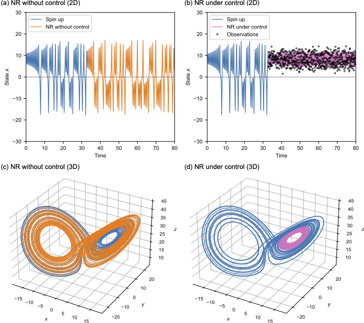

# cse
Control simulation experiment

### The project contains the control simulation experiment with the following two references.

```LaTeX
@Article{miyoshi2022control,
  author  = {Miyoshi, T. and Sun, Q.},
  journal = {Nonlinear Processes in Geophysics},
  title   = {Control simulation experiment with {Lorenz's} butterfly attractor},
  year    = {2022},
  number  = {1},
  pages   = {133--139},
  volume  = {29},
  doi     = {10.5194/npg-29-133-2022},
  file    = {:Miyoshi_and_Sun-2022-NPG.pdf:PDF},
  groups  = {CSE},
}
```
```
@Article{ouyang2023reducing,
  author  = {Ouyang, M. and Tokuda, K. and Kotsuki, S.},
  journal = {Nonlinear Processes in Geophysics},
  title   = {Reducing manipulations in control simulation experiment based on instability vectors with {Lorenz-63} model},
  year    = {2023},
  volume  = {30,}
  pages   = {1--11},
  volume  = {2023},
  doi     = {10.5194/npg-30-1-2023},
}
```

### Requirements
The code is tested on the gfortran compiler, with the "openblas" and "lapack" for accelerating the math calculation.

### Example
Following is an example of the control simulation experiment with Lorenz-63 model.



I hope the code provided here could be of some help to the control research with ensemble members. 
I always welcome any discussions and questions, please contact me through: ouyang.mao@chiba-u.jp. 
